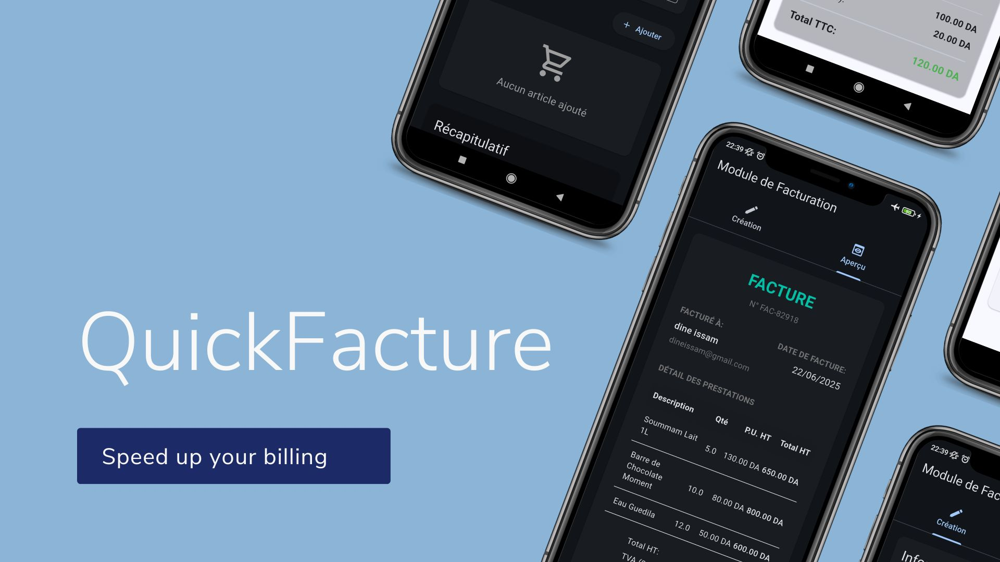
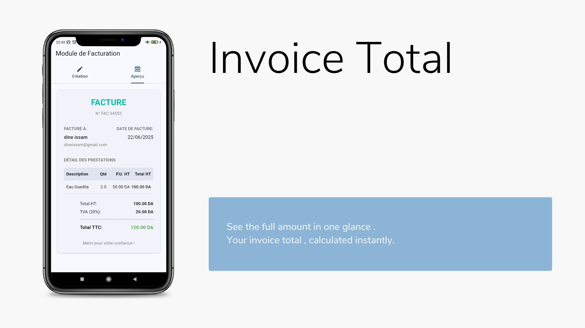
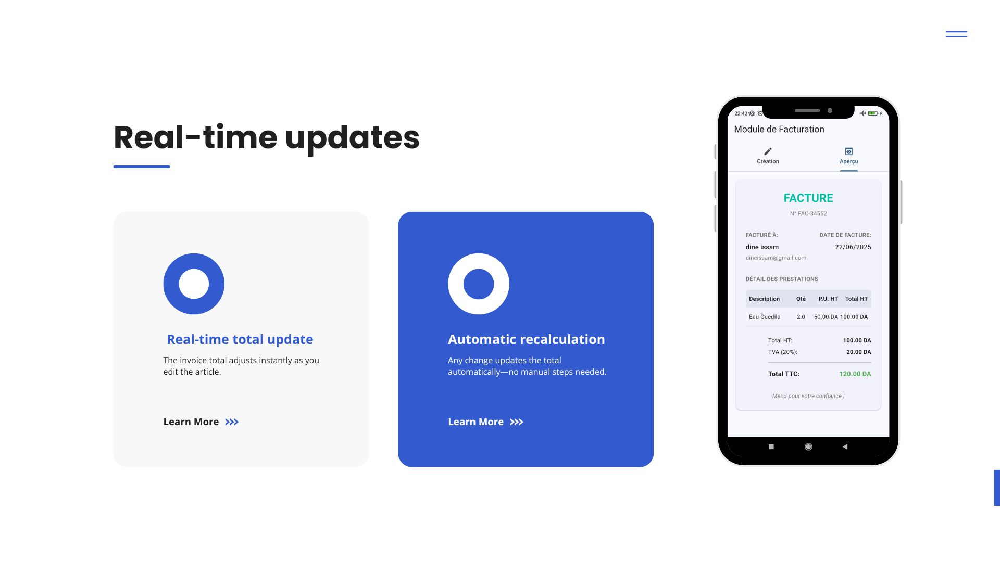
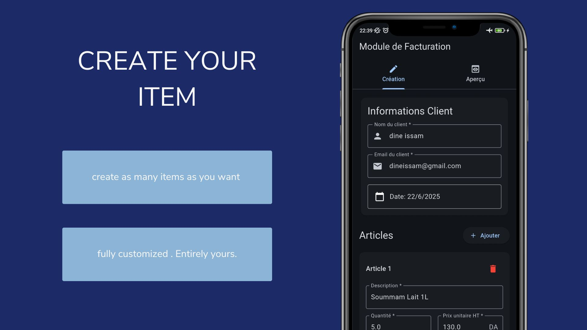

# 📄 Quick Facture

A mobile-friendly invoicing module built with Flutter. This app provides a dynamic user interface for creating, managing, and previewing invoices in real-time.

---

## 🎯 Objective

This app was developed as a coding challenge for a Flutter Front-End invoicing module. It fulfills the following requirements:

- A dynamic mobile UI to create an invoice
- Add/remove article line items with automatic calculations
- Real-time preview of the structured invoice

---

## 🧾 Features

### 1. Invoice Creation Screen

- 👤 Customer Name (TextField)
- 📧 Customer Email (TextField)
- 🗓️ Invoice Date (DatePicker or button)
- 📦 Dynamic article list:
  - Description
  - Quantity (numeric validation)
  - Unit Price (HT, numeric validation)
  - Total HT (calculated automatically)
- ➕ Add Article Button
- 🧮 Dynamic totals:
  - Total HT
  - TVA (20%)
  - Total TTC

### 2. Article Management

- Articles are dynamically managed using a list of cards
- Add/Delete articles dynamically
- Totals are recalculated in real-time
- Empty state message: “Aucun article ajouté” when no items exist

### 3. Invoice Preview

- Client details
- Invoice date
- Table with article description, quantity, unit price, and total
- Totals (HT, TVA, TTC)
- Design mimics real invoice layout for clarity

---

## ✨ Bonus Features

- Modular structure (InvoiceForm, ArticleItem, InvoicePreview)
- Clean and structured UI using:
  - `ListView`, `Card`, `Divider`
- Light/Dark theme support (WIP)
- Responsive layout for both portrait and landscape modes

---

## 🧑‍💻 Technical Choices

- Flutter & Dart with native state management (`setState`, `TextEditingController`, `List`, `Form`, `Card`)
- Modular component design for better code readability
- State synced with dynamic UI changes
- Real-time invoice rendering logic within preview section

---

## 📸 Screenshots

### 🧾 Invoice Creation Screen



### 📄 Invoice Preview



### 🌗 Dark Mode Preview



---

## 🗂️ Project Structure

```
lib/
├── main.dart
│
├── components/
│   ├── article_item_component.dart
│   └── total_card_component.dart
│
├── models/
│   ├── article.dart
│   └── invoice.dart
│
├── screens/
│   └── invoice_screen.dart
│
├── widget/
│   ├── create_invoice.dart
│   └── preview_invoice.dart
```
---

## ✅ Evaluation Criteria

- Mastery of basic state management (`setState`)
- Dynamic form handling (validation, calculations)
- Dynamic widget repetition
- Code structure and modularity
- Visual polish and usability

---

## 📌 TODOs / Improvements

- Export invoice as PDF
- Add storage or database integration
- Add customer/client fields

---

## 🧑‍💻 Author

Created by **Dine Mohammed Issam**. Feel free to contribute or suggest improvements!

